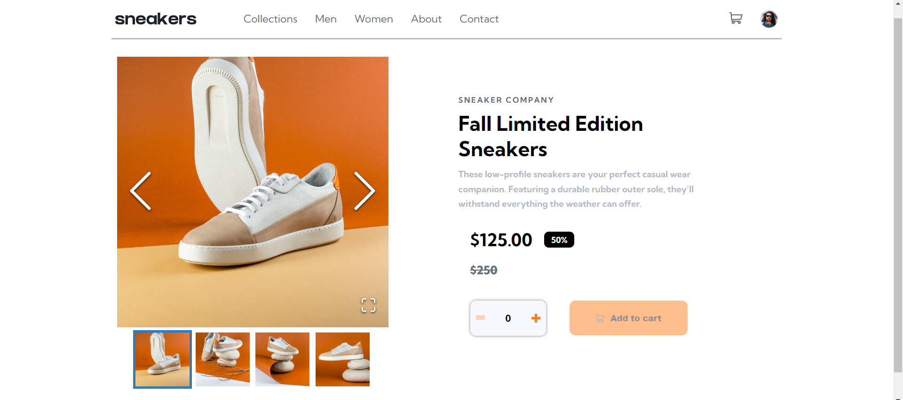

# Frontend Mentor - E-commerce product page

## Welcome! 👋

Thanks for checking out this fr# Frontend Mentor - E-commerce product page solution

This is a solution to the [E-commerce product page challenge on Frontend Mentor](https://www.frontendmentor.io/challenges/ecommerce-product-page-UPsZ9MJp6). Frontend Mentor challenges help you improve your coding skills by building realistic projects.

## Table of contents

- [Overview](#overview)
  - [The challenge](#the-challenge)
  - [Screenshot](#screenshot)
  - [Links](#links)
- [My process](#my-process)
  - [Built with](#built-with)
  - [What I learned](#what-i-learned)
  - [Continued development](#continued-development)
  - [Useful resources](#useful-resources)
- [Author](#author)

## Overview

### The challenge

Users should be able to:

- View the optimal layout for the site depending on their device's screen size
- See hover states for all interactive elements on the page
- Open a lightbox gallery by clicking on the large product image
- Switch the large product image by clicking on the small thumbnail images
- Add items to the cart
- View the cart and remove items from it

### Screenshot



### Links

- Solution URL: [My solution URL](https://diego2drm.github.io/ecommerce-product/)
- Live Site URL: [Mylive site URL](https://github.com/Diego2Drm/ecommerce-product)

## My process

### Built with

- Semantic HTML5 markup
- CSS custom properties
- Flexbox
- CSS Grid
- Mobile-first workflow
- [Vite + React](https://vitejs.dev/guide/) - JS library
- [React Image Gallery](https://www.npmjs.com/package/react-image-gallery) - NPM

### What I learned

```Jsx -createContext-
import React, { createContext, useState } from "react";

const ShoppingShoesContext = createContext();

const ShoppingShoesProvider = ({ children }) => {
  const [shoesCount, setShoesCount] = useState(0);

  return (
    <ShoppingShoesContext.Provider
      value={{
        shoesCount,
        setShoesCount,
      }}
    >
      {children}
    </ShoppingShoesContext.Provider>
  );
};

export { ShoppingShoesProvider };
export { ShoppingShoesContext };
```

```css
    CSS Modules
    import style from "./index.module.css"
    <section className={style.layout}>{children}</section>;
```

### Continued development

- React Hooks
- CSS Modules

### Useful resources

- [React Image Gallery](https://www.npmjs.com/package/react-image-gallery) - This helped me for Images Carousel.

## Author

- Github - [Diego](https://github.com/Diego2Drm)
- Frontend Mentor - [@Diego2Drm](https://www.frontendmentor.io/profile/Diego2Drm)
